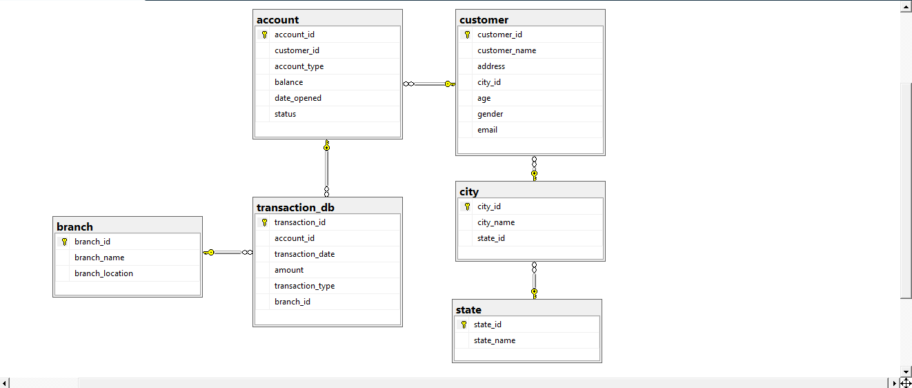

# final-task-pbi-de-rakamin-idx

## Intro

Project ini adalah pengerjaan **Data Engineer Test** (Rakamin Academy - VIX Project Based Internship).
Membangun Data Warehouse (DWH) dan dua stored procedure untuk salah satu client ID/X Partners di industri perbankan.

## Background

Client menyimpan data pada beberapa sumber berbeda: file Excel, file CSV, dan database SQL Server (`sample`). 
Karena tersebar di format dan sistem yang berbeda, tim client kesulitan mengekstrak data secara bersamaan untuk kebutuhan pelaporan, sehingga analisis data mereka selalu terlambat.

## Case

Sumber data yang tersedia:


| Source              | Tipe                  | Isi                     |
| ------------------- | --------------------- | ----------------------- |
| `transaction_excel` | File Excel            | Data transaksi          |
| `transaction_csv`   | File CSV              | Data transaksi          |
| `transaction_db`    | SQL Server (`sample`) | Data transaksi          |
| `account`           | SQL Server (`sample`) | Data rekening           |
| `customer`          | SQL Server (`sample`) | Data customer           |
| `branch`            | SQL Server (`sample`) | Data kantor cabang bank |
| `city`, `state`     | SQL Server (`sample`) | Data lokasi customer    |


Relasi antar tabel **source** adalah sebagai berikut.


## Task

1. Buat database `DWH` dengan 3 dimension table (`DimAccount`, `DimCustomer`, `DimBranch`) dan 1 fact table (`FactTransaction`), lengkap PK/FK
2. ETL Job 1: load seluruh source ke tabel dimension (`DimCustomer` dari join `customer` + `city` + `state`, kolom teks di-uppercase kecuali`CustomerID`/`Age`/`Email`)
3. ETL Job 2: gabungkan `transaction_excel` + `transaction_csv` + `transaction_db` ke `FactTransaction` tanpa row duplikat
4. Buat 2 stored procedure: `DailyTransaction` (ringkasan transaksi harian) dan `BalancePerCustomer` (sisa saldo per customer)

Detail lengkap alasan desain, hasil, dan demo ada di file presentasi (`docs/`).

## Struktur project

```
final_task_pbi_de_rakamin_idx/
├── docs/
│   └── (PDF final submission / presentasi)
├── images/
│   ├── source_erd.png            # relasi tabel source (sample.bak)
│   └── dwh_erd.png               # star schema DWH
├── sql/
│   ├── create_dwh.sql            # DDL: buat database DWH, 4 tabel, PK/FK
│   ├── etl_validation_1.sql      # query cek hasil ETL 1 (dedup, naming convention, uppercase)
│   ├── etl_validation_2.sql      # query cek hasil ETL 2 (dedup pada TransactionID)
│   ├── stored_procedure_1.sql    # stored procedure DailyTransaction
│   └── stored_procedure_2.sql    # stored procedure BalancePerCustomer
├── src/
│   ├── config.py                 # baca .env, bangun connection string
│   ├── db.py                     # SQLAlchemy engine factory (cached)
│   ├── extract.py                # ambil data mentah dari tiap source
│   ├── transform.py              # rename ke PascalCase, uppercase, parsing tanggal, dedup
│   ├── load.py                   # clear_table & load_table
│   └── flows/
│       ├── dim_flow.py           # ETL Job 1: load 3 tabel dimension
│       └── fact_flow.py          # ETL Job 2: merge 3 sumber transaksi ke FactTransaction
├── scripts/
│   └── test_connection.py        # cek koneksi ke DB source & DWH sebelum run flow
├── data/                         # data transaction_excel.xlsx & transaction_csv.csv
├── pyproject.toml                # dependency (uv)
├── .env.example                  # template konfigurasi (.env)
└── README.md
```


## Prasyarat

- SQL Server + SSMS terinstall, database `sample` sudah di-restore dari `sample.bak`
- Python 3.10+ dan [uv](https://docs.astral.sh/uv/) terinstall
- ODBC Driver 17/18 for SQL Server terinstall
- (Opsional) akun [Prefect Cloud](https://app.prefect.cloud) kalau mau memantau flow run lewat dashboard


## Setup & cara pakai


### 1. Buat struktur DWH

Di SSMS, jalankan berurutan:

```
sql/01_create_dwh.sql (buat database DWH, tabel, PK/FK)
```


### 2. Setup environment Python

```powershell
uv sync
cp .env.example .env
```

Edit `.env`:

- `SRC_DB_SERVER`, `SRC_DB_NAME`, `DWH_DB_SERVER`, `DWH_DB_NAME`, `DB_DRIVER` sesuai setup SQL Server
- `PREFECT_API_URL` + `PREFECT_API_KEY` kalau pakai Prefect Cloud, atau kosongkan `PREFECT_API_URL` dan set `PREFECT_SERVER_ALLOW_EPHEMERAL_MODE=true` untuk mode lokal
- Pastikan `transaction_excel.xlsx` dan `transaction_csv.csv` sudah ada di folder `data/`


### 3. Test koneksi

```powershell
uv run python -m scripts.test_connection
```

Harus keluar `[OK]` untuk source dan DWH sebelum lanjut.

### 4. Jalankan ETL

```powershell
uv run python -m src.flows.dim_flow    # Job 1: DimBranch, DimCustomer, DimAccount
uv run python -m src.flows.fact_flow   # Job 2: FactTransaction (merge, dedup)
```


### 5. Validasi hasil

Jalankan `sql/etl_validation_1` dan `sql/etl_validation_2` di SSMS untuk memastikan tidak ada duplikat, dan kesesuaian penamaan kolom

### 6. Buat stored procedure

Di SSMS, jalankan stored procedure

```sql
sql/stored_procedure_1.sql (DailyTransaction)
sql/stored_procedure_2.sql (BalancePerCustomer)
```


### 7. Coba stored procedure

```sql
EXEC DailyTransaction @start_date = '2024-01-18', @end_date = '2024-01-20';
EXEC BalancePerCustomer @name = 'Shelly';
```

